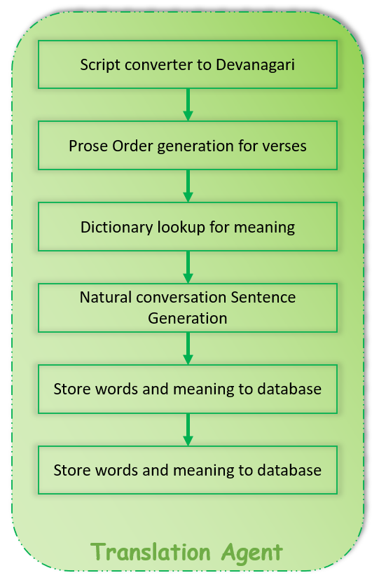
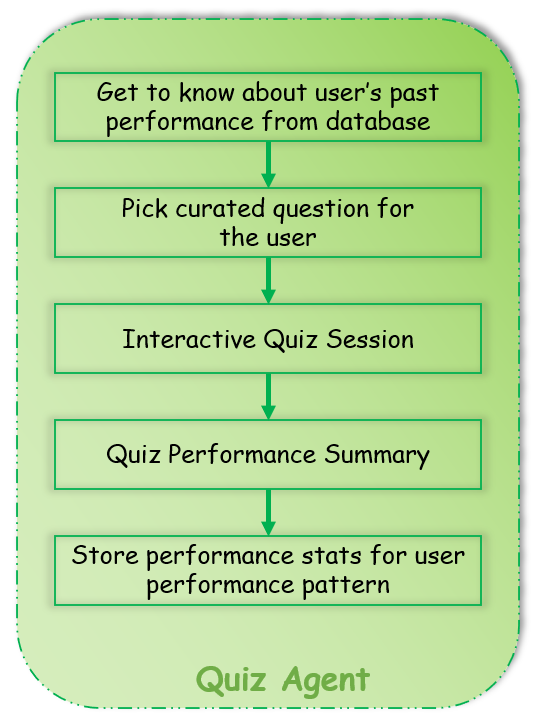

# sanskrita-saarathi-ai-agents-capstone-project
Agents Intensive - Capstone Project | Google ADK

---

# Problem Statement
Despite a growing interest in Sanskrit, learners struggle to understand its poetic and scriptural content because traditional comprehension skills and contextual understanding have gradually faded. Meanings, interpretations, and explanations are scattered across books, commentaries, and websites — forcing learners to spend more time searching than actually learning. Without structured practice and effective retention techniques, mastery becomes even more difficult.

As a result, the transformative wisdom of Sanskrit remains inaccessible to many who seek not merely language skills but inner growth through understanding its verses. Sanskrit has always fascinated me — its ability to encode profound knowledge through poetry and songs is unmatched. Learning it is challenging, but deeply rewarding. Even a slight reduction in learning friction can help more people discover answers that guide them toward clarity, purpose, and ultimately, happiness — something every human seeks.

## Note
This idea can be extended to every other language we forgot to cherish.

# The Solution
A multi agent model that can help user translate verses and quiz learners in a smart way (ensure spaced repetition while learning and retrying incorrect responses in the past).

# Why agents?
Agents have the ability to interact with different sources and tools. Help generate some meaning out of verses. AI models LLMs are capable of doing it, but Agents can help it take a step further. We can have deterministic dictionary fetches that are hard for humans especially for those are starting the journey it can be tiresome. Agents can combine the deterministic lookup and probabilistic interpretation of text.

# Target Idea
A multi agent model that can help user translate verses and quiz learners in a smart way.

# Implementation
Two multi agent models (currently every part of the model is probabilistic, except for database interactions)
- **Translation Agent**: that can help users translate verses using multiple sub agents (all probabilistic, currently)
- **Quiz Agent**: that can quiz users to have learning and fun at the same time

## Architecture
### Translation Agent

### Quiz Agent

The implementation notebook can be found [here](implementation_notebook_final.ipynb)
## What to expect in the notebook?
- This notebook details the implementation of various agents used in the Sanskrit Saarathi AI Agents Capstone Project.
- Each section has a brief description of the agent's purpose and functionality.
- Stop at `Tech Note` section to see some highlights of the implementation.
## Before running the notebook
- Make sure to have python installed
- Install the dependencies using `pip install -r requirements.txt`
    - If you'd like, create a virtual environment using `python -m venv venv` and activate it before installing dependencies
- Get the following API keys
    - Notion
        - Create a Notion integration [here](https://www.notion.so/my-integrations)
    - Google
        - AI Studio account: Sign up for an AI Studio account and generate an [API key](https://aistudio.google.com/app/api-keys)

# ADK Web demo
## Translation Agent

## Quiz Agent

---

# Author
Rohinth Ram R V

# Citation
Done as a part of [Agents Intensive - Capstone Project](https://www.kaggle.com/competitions/agents-intensive-capstone-project)

